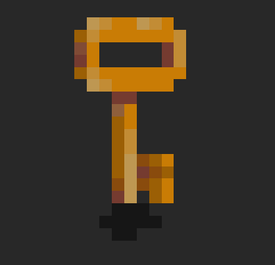
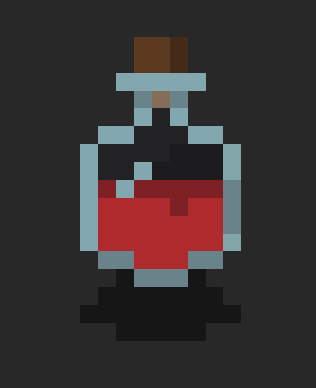
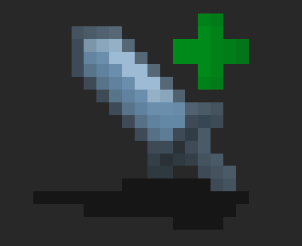
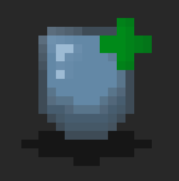
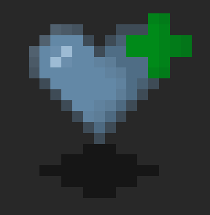
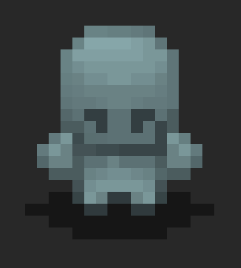
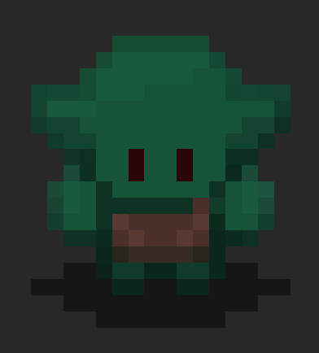
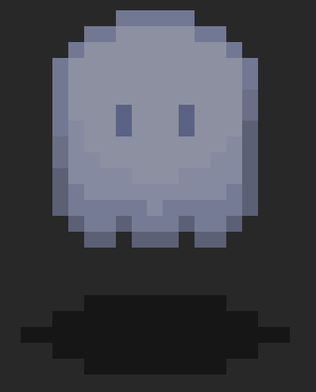

# Règles du jeu Tedium

## Histoire

Dans un monde déchiré par les conflits et envahi par les forces du mal, une légende raconte l'existence d'un être exceptionnel connu sous le nom de "l'Errant". Personne ne connaît son véritable nom ni son origine, mais sa présence est annoncée par des rumeurs sinistres et des signes étranges.

L'Errant est un être solitaire, hanté par un passé trouble et des secrets insondables. On dit qu'il a été maudit, condamné à errer éternellement à travers des dimensions sombres et tortueuses. Il porte en lui une puissance magique dévastatrice, mais aussi destructrice pour son propre être.

Un jour, dans un dernier espoir de rédemption, l'Errant décide d'affronter les forces du mal qui ravagent le monde. Il pénètre dans un donjon ancestral, où chaque étage est un défi mortel. Les monstres y rôdent, assoiffés de sang, tandis que les pièges et les énigmes défient toute logique.

Cependant, plus l'Errant avance, plus il risque de sombrer dans les ténèbres qui le tourmentent. Sa puissance magique grandit, mais il se consume de l'intérieur. La ligne entre le salut et la damnation devient floue, et l'Errant doit faire face à son destin, quel qu'il soit.

## Déroulement

Vous incarnez l'Errant et votre but est de trouver désespérément la sortie du labyrinthe. En vous déplaçant, vous devrez faire face à des choix difficiles et combattre de terribles monstres pour acquérir des objets vitaux.

## But du jeu

Votre but est de trouver le portail qui vous permettra d'atteindre l'ascension.

## Interaction avec l'environnement

Il suffit de passer sur la case de l'objet pour le récupérer.
Avec une clé, vous pourrez ouvrir une porte qui disparaîtra pour toujours une fois ouverte. Cette clé étant consommable, elle disparaîtra de votre inventaire après l'ouverture.

### Consommables

|  | Item | Explication |
| --- | --- | --- |
|  | Clé | La clé est stockée dans l'inventaire et s'utilise automatiquement lorsque vous entrez dans une porte. |
|  | Potion | La potion redonne toute la vie au joueur. |
|  | Power-up d'attaque | Votre attaque augmente de 1. |
|  | Power-up de défense | Votre défense augmente de 1. |
|  | Power-up de vie | Votre vie maximale augmente de 3. |

### Les monstres

|  | PV | Force  | Armure |
| --- | --- | --- | --- |
|  Squelette | 5 | 1 | 1 |
|  Gobelin | 10 | 3 | 2 |
|  Fantôme | 20 | 5 | 4 |

### Commandes de jeu

Vous pouvez jouer au jeu en utilisant les commandes ZQSD ou WASD ou les flèches.

### Mode de triche

En appuyant simultanément sur les touches "cheat", vous passez en mode de triche.